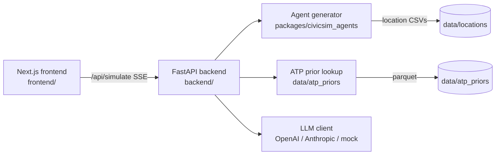
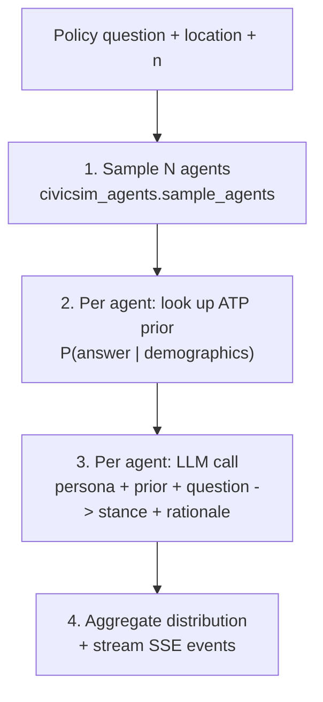

# CivicSim Architecture

This document describes how the public demo is wired together. For research methodology, see the CivicSim paper (linked below).

## High-level



## Per-request pipeline (`POST /api/simulate`)



SSE events emitted in order:

| Event | Payload |
|---|---|
| `agent_sampled` | One per agent: `{agent_id, demographics}` |
| `prior_attached` | One per agent: `{agent_id, prior: [{answer, prob}]}` |
| `agent_responded` | One per agent: `{agent_id, stance, rationale}` |
| `aggregate` | Once at the end: `{distribution: [{answer, prob}], n}` |
| `done` | Once: `{}` |

## Data provenance

| Asset | Source | Lives in |
|---|---|---|
| `data/locations/alameda_california/*.csv` | American Community Survey (ACS), 5-year aggregates, Alameda County, CA | Public repo |
| `data/atp_priors/policy_priors.parquet` | Compiled from `s3://civicsim-data/parquet/atp_2021_2024_final.parquet` (Pew American Trends Panel, waves W80–W159) | Public repo (compact lookup only) |
| Raw ATP `.sav` files | Pew Research, ATP datasets program | Private S3 (`civicsim-data/raw/atp/`) |
| Raw ACS `.dat` extract | IPUMS USA, extract `usa_00003` | Private (local only, ~2.2 GB) |

The compact ATP lookup only retains, per (curated_question_id × demographic_cell), the answer-share distribution. No PII, no respondent IDs.

## Agent generation model

Implemented in [`packages/civicsim_agents`](packages/civicsim_agents). For a location, four marginal distributions are loaded (age, race, occupation, income). With `diverse=True` (default), each demographic axis is allocated to N via largest-remainder so the sample exactly matches the population marginals; the four axes are then independently shuffled to produce N (age, race, occupation, income) tuples. With `diverse=False` it falls back to independent draws.

This is the same code that originated in [`civicsim-agent_probabilisitc_model/main.py`](civicsim-agent_probabilisitc_model/main.py); `packages/civicsim_agents/` is the importable refactor used by the API.

## Opinion prior lookup

`data/atp_priors/policy_priors.parquet` is keyed by:

```
question_id (str) | age_group | gender | race_eth | education_group | income_group | urbanicity | answer_label | prob
```

Lookup with backoff: at request time we filter on the most specific demographic cell available; if no rows match (sparse cell), we drop the least-informative dimension and retry. Order of dropping: `urbanicity` → `income_group` → `education_group` → `race_eth` → `gender` → `age_group`. Always returns *some* prior unless the question is entirely missing.

## LLM grounding

System prompt template (excerpt):

> You are simulating a single voter with the following demographics: {age}, {race}, {income}, {occupation}.
> In recent national polls, **people in your demographic group answered "{question}" as follows**:
> {prior_distribution}
> Respond as one such person. Pick one answer, then give a one-sentence rationale.

The prior is injected verbatim. Without it, the LLM defaults to its own (often biased) priors; with it, per-agent stances cluster around the empirical distribution. See Experiment 2 in the private research repo for the ablation that motivates this.

## What's *not* in this repo

- Raw ATP `.sav` and ACS `.dat` files (private, on S3).
- The full Pew/ACS experiments (`PEW_data_Experiment1..3` in `CivicSim_Main`).
- Multi-county support — only Alameda County, CA in v1.
- Survey collection / Supabase / auth (lives in the private survey app).

## Paper

`civicsim.pdf` (link to be added once published).
