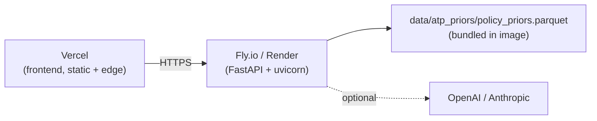

# Deployment

The public demo is split: a Python FastAPI service and a Next.js frontend. They can be deployed independently. This guide walks the recommended path: backend on Fly.io (or Render), frontend on Vercel.



## Environment variables

Set these where indicated. None of them ever go in source control.

| Var | Where | Required? | Notes |
|---|---|---|---|
| `LLM_PROVIDER` | backend | yes | One of `mock` (no API key needed), `openai`, `anthropic` |
| `LLM_MODEL` | backend | optional | Default `gpt-4o-mini` |
| `OPENAI_API_KEY` | backend | if provider=openai | |
| `ANTHROPIC_API_KEY` | backend | if provider=anthropic | |
| `CORS_ORIGINS` | backend | yes | Comma-separated. Must include the Vercel frontend origin |
| `ATP_PRIORS_PATH` | backend | optional | Default `../data/atp_priors/policy_priors.parquet`. In Docker we set `/app/data/atp_priors/policy_priors.parquet` |
| `LOG_LEVEL` | backend | optional | Default `INFO` |
| `NEXT_PUBLIC_API_BASE_URL` | frontend | yes | Public URL of the deployed backend, e.g. `https://civicsim-api.fly.dev` |

## Backend — Fly.io

```bash
# One-time
fly launch --no-deploy --copy-config --name civicsim-api
# fly.toml is generated. Make sure it points at backend/Dockerfile and exposes 8000.

# Set secrets
fly secrets set \
    LLM_PROVIDER=openai \
    OPENAI_API_KEY=sk-... \
    CORS_ORIGINS=https://YOUR-FRONTEND.vercel.app

fly deploy
```

The Dockerfile at `backend/Dockerfile` is multi-context aware — `fly deploy` should be run from the repo root, since the image copies both `packages/civicsim_agents/` and `data/` alongside `backend/`.

### Backend — Render alternative

1. Create a new **Web Service**, point it at this repo.
2. Root directory: `.` (repo root, not `backend/`)
3. Dockerfile path: `backend/Dockerfile`
4. Add the env vars from the table above.

## Frontend — Vercel

```bash
# From the frontend/ directory
vercel --prod
```

Configure in the Vercel dashboard:

* **Framework**: Next.js
* **Root Directory**: `frontend`
* **Environment Variables**:
  * `NEXT_PUBLIC_API_BASE_URL` = the deployed backend URL

The frontend uses Next.js rewrites to proxy `/api/*` to the backend (see [frontend/next.config.ts](frontend/next.config.ts)), which keeps SSE same-origin in the browser.

## Local Docker (alternative to host deploys)

```bash
cp .env.example .env       # then edit
docker compose up --build
# frontend: http://localhost:3000
# backend:  http://localhost:8000/docs
```

## Refreshing ATP priors (private)

The bundled `data/atp_priors/policy_priors.parquet` is a small, redistributable lookup. To rebuild it from the private S3 source (requires AWS creds and access to `s3://civicsim-data/parquet/`):

```bash
python scripts/build_atp_priors.py \
    --source s3://civicsim-data/parquet/atp_2021_2024_final.parquet \
    --question-labels s3://civicsim-data/parquet/atp_2021_question_labels.parquet \
    --answer-labels   s3://civicsim-data/parquet/atp_2021_answer_labels.parquet \
    --out data/atp_priors/policy_priors.parquet
```

Then commit the resulting parquet. The full ATP/ACS pipelines themselves stay in the private research repo.

## Demo URL

| Surface | URL |
|---|---|
| Frontend | `https://civicsim.example.com` _(replace once deployed)_ |
| Backend  | `https://civicsim-api.example.com` _(replace once deployed)_ |
| API docs | `https://civicsim-api.example.com/docs` |
