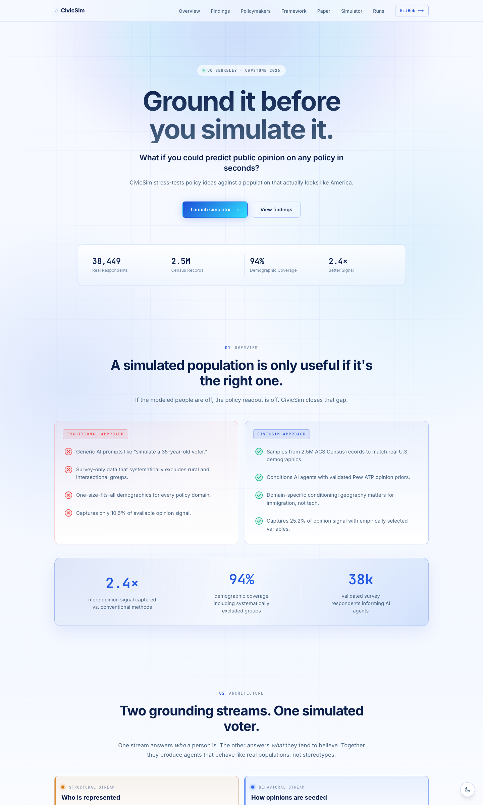
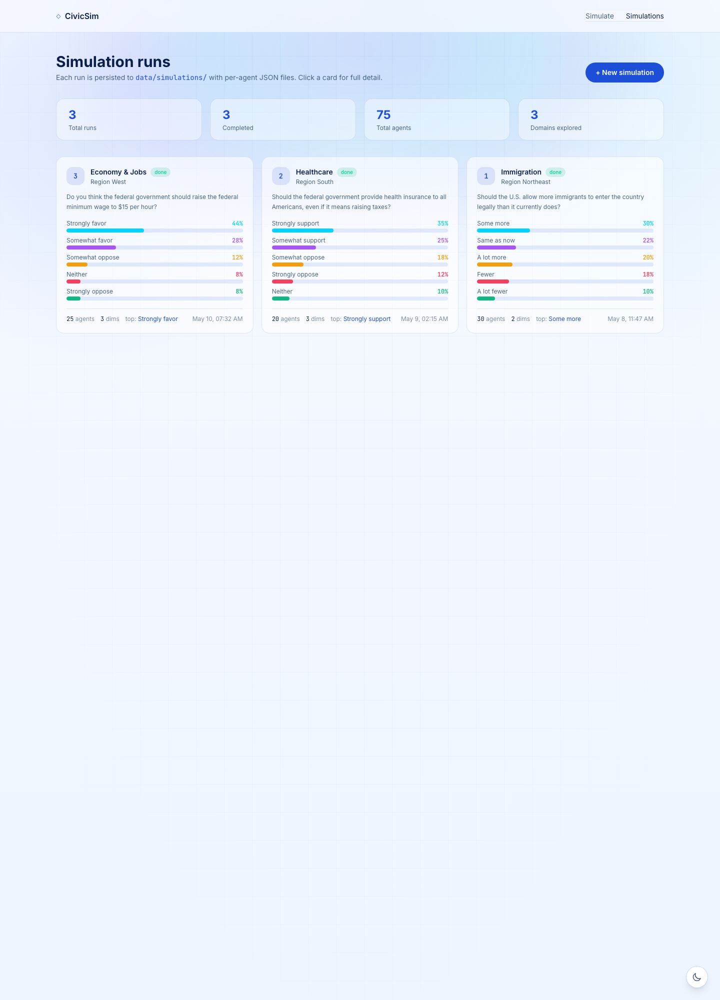
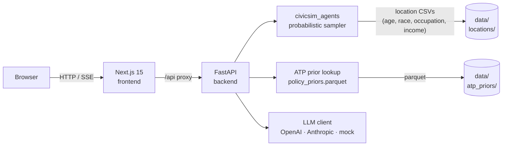
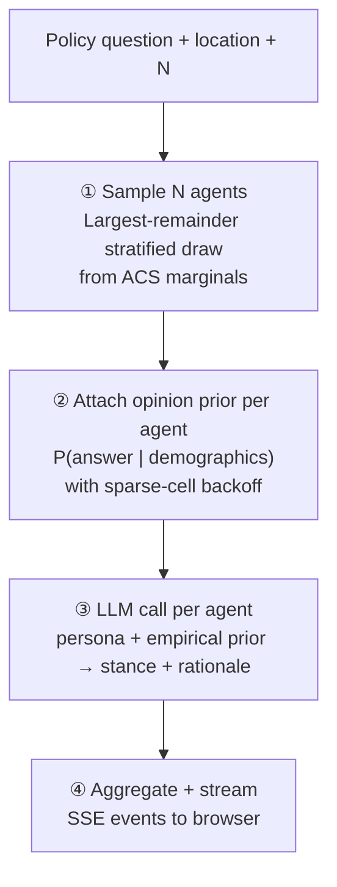

<div align="center">


**Ground it before you simulate it.**

Demographically grounded LLM simulation of public opinion — backed by 2.5M Census records and 38,449 validated survey respondents.

[](https://github.com/Sushanti99/CivicSim/actions/workflows/backend-ci.yml)
[](https://github.com/Sushanti99/CivicSim/actions/workflows/frontend-ci.yml)
[](https://www.python.org/)
[](https://nodejs.org/)
[](LICENSE)

**[civicsim.xyz](https://civicsim.xyz) · [API Docs](https://civicsim.xyz/docs) · [Paper](#paper)**

</div>

---

CivicSim is a public opinion simulation platform built at UC Berkeley (Capstone 2026). Pick a U.S. location, choose a policy question, and run a synthetic electorate sampled from ACS Census microdata and conditioned on Pew American Trends Panel opinion priors — not on what a generic LLM thinks a voter believes.

The core argument: **the** ***who*** **being simulated is a methodological choice, not a default.** CivicSim makes it an empirical one.

---

## Screenshots

<table>
  <tr>
    <td align="center"><b>Landing</b></td>
    <td align="center"><b>Simulator</b></td>
    <td align="center"><b>Simulation Runs</b></td>
  </tr>
  <tr>
    <td></td>
    <td></td>
    <td></td>
  </tr>
</table>

---

## The Problem

Conventional LLM-based opinion simulation fails at the input layer — before a single token is generated:

| Conventional approach | What goes wrong |
|---|---|
| Generic prompt: "simulate a 35-year-old voter" | Outputs stereotypes, not a real demographic distribution |
| Survey-only sampling | Systematically excludes rural and intersectional groups |
| Textbook variables: `{age, income, education}` | Captures only **10.6%** of the available joint opinion signal |
| One-size-fits-all geographic conditioning | Overconditions on geography for technology policy; underconditions for international affairs |

CivicSim's empirical corrections:

- **2.4×** more opinion signal vs. conventional variable selection
- **94%** demographic coverage, including systematically excluded subgroups
- **38,449** validated Pew ATP respondents backing every agent's prior

---

## Research Findings

Three studies establish the methodology. Each identified a failure mode and the correction CivicSim applies.

### Study 1 — The survey is not the population

Post-stratification weighting corrects marginal distributions, not joint distributions in sparse subgroups.

- Young Black Americans (18–29): TVD of **0.321** between survey and census income distribution — nearly a third of the mass lands in the wrong bracket
- Rural × low-income: **14× the full-sample baseline** misalignment on Census division

**Correction:** sample agents from ACS PUMS microdata (~2.5M adult records/year), not from the survey sample.

### Study 2 — Marginal rankings are the wrong variable selection tool

We exhaustively tested every combination of 7 demographic variables across 1,426 opinion items.

| Variable set | Signal captured |
|---|---|
| Conventional `{age, income, education}` | 10.6% of full joint signal |
| Greedy-optimal `{race, location, age}` | **25.2%** of full joint signal |

Census division causes a **−53.5% signal drop** in leave-one-out analysis — the largest of any variable — yet marginal ranking places it third, so the textbook approach omits it entirely.

**Correction:** select conditioning variables via greedy information-gain ablation per domain, not by marginal importance.

### Study 3 — Geography is domain-specific, not universal

After demographic conditioning, most domains pool nationally. One does not.

| Geography need | Domains | JSD after conditioning |
|---|---|---|
| Not needed | Technology, Environment | 0.119 |
| Optional | Health, Economy, Immigration, Politics, … | 0.129–0.150 |
| **Required** | **International affairs** | **0.174** |

For 18–29 year olds, geographic variation is up to **70% higher** than for older cohorts in every income tier — tier geography up by one level for young agents regardless of domain.

**Correction:** apply tiered geographic conditioning based on empirical domain classification.

---

## Architecture



### Per-Request Pipeline

Each call to `POST /api/simulate` streams SSE events through four stages:



| SSE event | Emitted | Payload |
|---|---|---|
| `agent_sampled` | per agent | `{agent_id, demographics}` |
| `prior_attached` | per agent | `{agent_id, prior: [{answer, prob}]}` |
| `agent_responded` | per agent | `{agent_id, stance, rationale}` |
| `aggregate` | once | `{distribution: [{answer, prob}], n}` |
| `done` | once | `{}` |

---

## Quickstart

**Prerequisites:** Python 3.11+, Node.js 20+

### Local development

```bash
# 1. Backend
cd backend
cp ../.env.example .env          # set LLM_PROVIDER=mock to run without an API key
pip install -e ../packages/civicsim_agents
pip install -r requirements.txt
uvicorn app.main:app --reload --port 8000
```

```bash
# 2. Frontend (separate terminal)
cd frontend
npm install
npm run dev
```

- App: http://localhost:3000
- API docs: http://localhost:8000/docs

### Docker

```bash
cp .env.example .env             # edit as needed
docker compose up --build
```

---

## Configuration

Copy `.env.example` to `.env` and set:

| Variable | Required | Default | Notes |
|---|---|---|---|
| `LLM_PROVIDER` | yes | — | `mock` · `openai` · `anthropic` |
| `LLM_MODEL` | no | `gpt-4o-mini` | Any model the provider supports |
| `OPENAI_API_KEY` | if `openai` | — | |
| `ANTHROPIC_API_KEY` | if `anthropic` | — | |
| `CORS_ORIGINS` | yes | `http://localhost:3000` | Comma-separated allowed origins |
| `ATP_PRIORS_PATH` | no | `../data/atp_priors/policy_priors.parquet` | |
| `NEXT_PUBLIC_API_BASE_URL` | yes | `http://localhost:8000` | Backend URL seen by the browser |

`LLM_PROVIDER=mock` returns deterministic stub responses and requires no API key — useful for local UI development and CI.

---

## API Reference

| Method | Path | Description |
|---|---|---|
| `GET` | `/healthz` | Health check — provider and priors status |
| `GET` | `/api/locations` | Supported simulation locations |
| `GET` | `/api/domains` | Policy domain catalog |
| `GET` | `/api/domains/{domain_id}` | Domain detail with available questions |
| `GET` | `/api/questions` | All available opinion questions |
| `POST` | `/api/agents` | Generate N synthetic demographic agents |
| `POST` | `/api/poll` | ATP prior distribution for a demographic cell |
| `POST` | `/api/simulate` | Run simulation — streams SSE |
| `GET` | `/api/simulations` | List saved runs |
| `GET` | `/api/simulations/{sim_id}` | Load a single saved run |

Full schemas at `/docs` (Swagger UI) or `/redoc`.

---

## Repo Layout

```
CivicSim/
├── backend/
│   ├── app/
│   │   ├── api/            Route handlers (agents, domains, locations, poll, simulate, simulations)
│   │   ├── core/           Config, logging, error handling
│   │   ├── models/         Pydantic request/response schemas
│   │   └── services/       Business logic (agent_generator, llm_client, opinion_prior, simulate, …)
│   ├── tests/
│   └── Dockerfile
│
├── frontend/
│   ├── app/
│   │   ├── page.tsx                  Research landing page
│   │   ├── simulate/page.tsx         Simulation runner
│   │   └── simulations/              Dashboard + detail view
│   ├── components/                   AgentTable, OpinionDistribution, RationaleList, pickers, ThemeToggle
│   ├── lib/api.ts                    Typed API client
│   └── Dockerfile
│
├── packages/
│   └── civicsim_agents/              Installable probabilistic agent sampler
│
├── data/
│   ├── locations/alameda_california/ ACS-derived CSVs (age, race, occupation, income)
│   ├── atp_priors/                   policy_priors.parquet — compact opinion prior lookup
│   └── simulations/                  Saved simulation run JSON files
│
├── scripts/
│   ├── build_atp_priors.py           Rebuild compact priors from private S3 source
│   ├── build_locations.py            Build location CSVs from ACS PUMS
│   └── build_domain_demographics.py
│
├── ARCHITECTURE.md                   Technical deep-dive
├── DEPLOYMENT.md                     Fly.io + Vercel deployment guide
└── docker-compose.yml
```

---

## `civicsim_agents` Package

The agent sampler is an installable Python package. The backend depends on it; it can also be used independently.

```bash
pip install -e packages/civicsim_agents
```

```python
from civicsim_agents import sample_agents, list_locations

list_locations()
# ['alameda_california']

df = sample_agents("alameda_california", n=50, seed=42)
# Returns a DataFrame with columns: age_group, race_eth, occupation, income_group
```

```bash
# CLI
civicsim-agents --location alameda_california --n_agents 25 --seed 42 --validate
```

**Adding a location:** drop four CSVs into `packages/civicsim_agents/civicsim_agents/data/<location_id>/` — `age.csv` (`category`, `count`), `race.csv` (`category`, `value`), `occupation.csv` (`category`, `totalestimate`), `income.csv` (`category`, `estimated`).

---

## Deployment

Recommended: **Vercel** (frontend) + **Fly.io or Render** (backend). The backend Docker image bundles `data/atp_priors/` and `packages/civicsim_agents/` — no external data dependency at runtime.

See [DEPLOYMENT.md](DEPLOYMENT.md) for the full step-by-step guide.

Production: **[civicsim.xyz](https://civicsim.xyz/)**

---

## Data

| Asset | Source | In repo |
|---|---|---|
| `data/locations/alameda_california/` | ACS 5-year aggregates, Alameda County CA | Yes |
| `data/atp_priors/policy_priors.parquet` | Pew ATP waves W80–W159 (2021–2024), compact lookup only — no PII | Yes |
| Raw ATP `.sav` files | Pew Research ATP datasets program | No — private S3 |
| Raw ACS `.dat` extract | IPUMS USA `usa_00003` (~2.2 GB) | No — local only |
| Full experiment notebooks | `CivicSim_Main` private repo | No |

---

## Paper

> **Ground It Before You Simulate It: The Case for Demographically Grounded LLM Simulations**
>
> We argue that current LLM-based public opinion simulations are not approximations of a representative population but consistent, predictable distortions at the input level, and that fixing this is methodologically prior to all other concerns about LLM agent quality.
>
> *CivicSim Team · UC Berkeley · 2026*

---

## License

MIT. If you use this in research, please cite the CivicSim paper once published.
