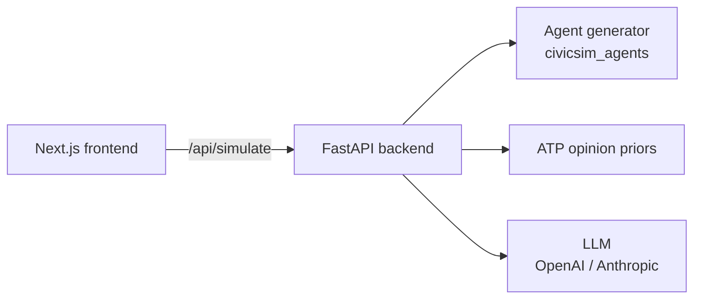

# CivicSim

> Ground it before you simulate it.

CivicSim is a public demo of demographically-grounded LLM simulation of public opinion. Pick a U.S. location, ask a policy question, and watch a synthetic electorate (sampled from census-style distributions, conditioned on Pew ATP-derived opinion priors) respond.

This repo is the **product / demo** half of the project. The research, raw data pipelines, and full experiment code live in the private companion repo `CivicSim_Main`.



## Quickstart

```bash
# 1. Backend
cd backend
cp ../.env.example .env          # fill in OPENAI_API_KEY or ANTHROPIC_API_KEY (optional)
pip install -e ../packages/civicsim_agents
pip install -r requirements.txt
uvicorn app.main:app --reload --port 8000

# 2. Frontend (separate terminal)
cd frontend
npm install
npm run dev                       # http://localhost:3000
```

Or with Docker:

```bash
docker compose up --build
```

## Repo layout

```
CivicSim/
  backend/                    FastAPI service (POST /api/simulate, /api/agents, /api/poll, GET /api/locations)
  frontend/                   Next.js 15 demo UI
  packages/
    civicsim_agents/          Installable Python package (probabilistic agent sampler)
  data/
    locations/                Per-location demographic distributions (CSVs)
    atp_priors/               Compact ATP-derived opinion lookup (parquet)
  scripts/
    build_atp_priors.py       Builds atp_priors/policy_priors.parquet from private S3 source
  civicsim-agent_probabilisitc_model/   Original CLI (kept for parity)
  acs_pums_data/                        Original notebook (kept for parity)
```

## API

| Method | Path | Body | Returns |
|---|---|---|---|
| `GET` | `/api/locations` | — | List of supported locations |
| `POST` | `/api/agents` | `{location, n, seed?}` | List of synthetic agents |
| `POST` | `/api/poll` | `{question_id, demographic_filter?}` | ATP opinion distribution |
| `POST` | `/api/simulate` | `{location, n, question_id \| free_text, model?}` | SSE stream of agent responses + aggregate |

Full schemas at `http://localhost:8000/docs` once the backend is running.

## What's *not* in this repo

- Raw Pew ATP `.sav` files and ACS PUMS `.dat` extracts (private, S3-hosted).
- The full Pew/ACS experiment code (`PEW_data_Experiment*`).
- Survey collection app + Supabase schema.
- Multi-county support beyond the bundled Alameda County demo.

These live in the private research repo (`CivicSim_Main`).

## Citation

If you use this demo in research, please cite the CivicSim paper (link in [ARCHITECTURE.md](ARCHITECTURE.md)).

## License

MIT.
