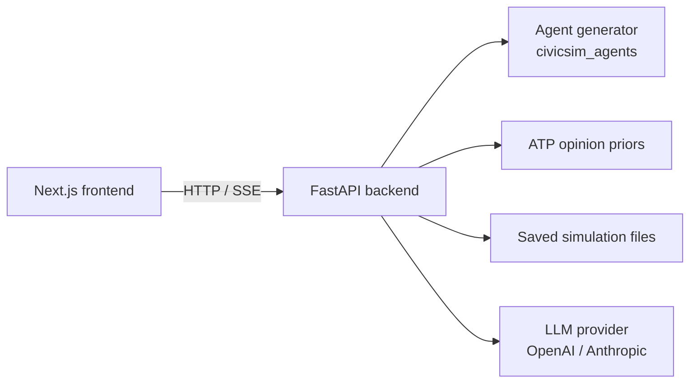

# CivicSim

> Ground it before you simulate it.

CivicSim is a public demo for demographically grounded LLM simulation of public
opinion. Pick a U.S. location, choose or write a policy question, and run a
synthetic electorate sampled from census-style demographic distributions and
conditioned on Pew ATP-derived opinion priors.

This repository is the product/demo half of the project. The research pipelines,
raw survey files, and full experiment code live in the private companion project
`CivicSim_Main`.

## Current Branch

The old website restoration and theme work lives on:

```bash
theme-old-website
```

This branch restores the original CivicSim public landing page style from the
old static website while keeping the current simulator product UI connected to
the same app.

## What This Includes

- A Next.js 15 frontend with:
  - `/` public research landing page
  - `/simulate` simulation runner
  - `/simulations` saved simulation dashboard
  - `/simulations/[sim_id]` simulation detail view
- A FastAPI backend for locations, questions, domains, polling, agent sampling,
  streaming simulations, and saved simulation metadata.
- A light/dark theme system with a floating theme toggle.
- Restored original landing-page visual language:
  - dark grid/glow research-site background
  - cyan/violet accent system
  - original hero/stat cards
  - original study cards, ablation comparison, domain grid, pipeline, and paper card
- Restored landing-page figures:
  - `frontend/public/assets/figures/architecture.png`
  - `frontend/public/assets/figures/fig_pop.png`
  - `frontend/public/assets/figures/fig_ablation.png`
  - `frontend/public/assets/figures/fig_loo.png`

## Architecture



## Quickstart

Run the backend first:

```bash
cd backend
cp ../.env.example .env
pip install -e ../packages/civicsim_agents
pip install -r requirements.txt
uvicorn app.main:app --reload --port 8000
```

Then run the frontend in a separate terminal:

```bash
cd frontend
npm install
npm run dev
```

Open `http://localhost:3000`.

The backend docs are available at `http://localhost:8000/docs` once FastAPI is
running.

Docker is also supported:

```bash
docker compose up --build
```

## Frontend Notes

The frontend lives in `frontend/` and uses Next.js, React, Tailwind CSS, and
Recharts.

Important files:

- `frontend/app/page.tsx`: restored public landing page based on the old static
  CivicSim website.
- `frontend/app/globals.css`: global theme tokens, old landing-page styles, grid
  background, glow background, and light/dark CSS variables.
- `frontend/app/layout.tsx`: root layout, background layers, theme init script,
  and theme toggle mount.
- `frontend/components/ThemeToggle.tsx`: client-side light/dark toggle persisted
  in `localStorage`.
- `frontend/app/simulate/page.tsx`: simulation runner.
- `frontend/app/simulations/page.tsx`: saved simulation dashboard.
- `frontend/app/simulations/[sim_id]/page.tsx`: saved simulation detail page.

Useful commands:

```bash
cd frontend
npm run dev
npm run build
npm run typecheck
```

## Backend API

Core endpoints:

| Method | Path | Purpose |
|---|---|---|
| `GET` | `/healthz` | Health check |
| `GET` | `/locations` | Supported simulation locations |
| `GET` | `/questions` | Available opinion questions |
| `GET` | `/domains` | Policy/opinion domains |
| `GET` | `/domains/{domain_id}` | Domain detail |
| `POST` | `/agents` | Generate synthetic agents |
| `POST` | `/poll` | Get ATP prior distribution |
| `POST` | `/simulate` | Stream simulated agent responses |
| `GET` | `/simulations` | List saved simulations |
| `GET` | `/simulations/{sim_id}` | Load one saved simulation |

Full request/response schemas are exposed through FastAPI docs at
`http://localhost:8000/docs`.

## Repo Layout

```text
CivicSim/
  backend/                  FastAPI service
  frontend/                 Next.js 15 frontend
  packages/
    civicsim_agents/        Installable probabilistic agent sampler
  data/
    locations/              Per-location demographic CSVs
    atp_priors/             Compact ATP-derived opinion priors
    simulations/            Saved simulation runs
  scripts/
    build_atp_priors.py     Builds compact ATP prior data from private source
  civicsim-agent_probabilisitc_model/
                            Original CLI kept for parity
  acs_pums_data/            Original notebook/data work kept for parity
```

## Theme System

The app uses CSS variables for both the restored landing page and simulator UI.
Light mode is the default, and dark mode is enabled by toggling the `dark` class
on the root HTML element.

Key tokens live in `frontend/app/globals.css`, including:

- `--color-bg`
- `--color-surface`
- `--color-border`
- `--color-text`
- `--color-cyan`
- `--color-violet`
- `--bg-grid-line`
- `--bg-glow-a`
- `--bg-glow-b`

The theme preference is stored under `civicsim-theme` in `localStorage`.

## What Is Not In This Repo

- Raw Pew ATP `.sav` files.
- Raw ACS PUMS `.dat` extracts.
- Full private Pew/ACS experiment notebooks and scripts.
- Private survey collection infrastructure.
- Full research pipeline from `CivicSim_Main`.

## Citation

If you use this demo in research, please cite the CivicSim paper once published.

## License

MIT.
